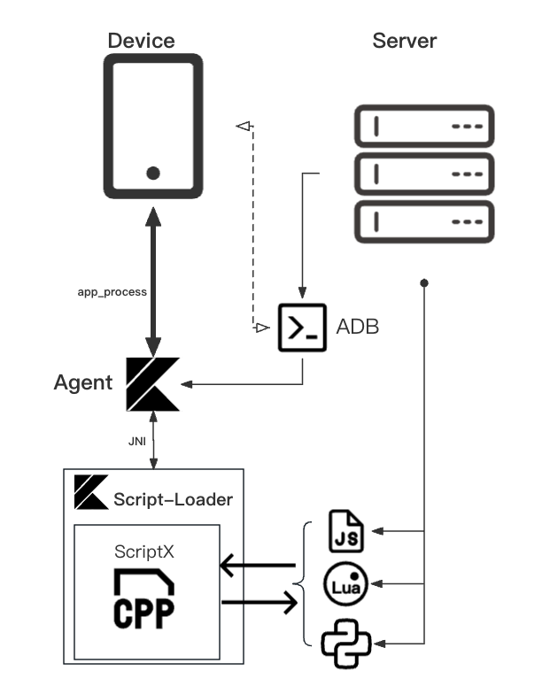

# AutoDroidX

Modern Android application automation testing toolset.

> ⚠️Warning! This project is in fast moving, and any disruptive API changes will not be notified in advance.

---

## Base

> We call it `adx` as abbreviation

adx is designed as a low-intrusive, multi-capability modern Android application automation testing toolkit. It consists of multiple modules, ultimately providing users with powerful automation testing capabilities. The design of its core module, `agent`, is inspired by [scrcpy](https://github.com/Genymobile/scrcpy) (in fact, it is a Kotlin implementation of scrcpy-server).

Here is a picture to briefly explain how it works.

## Module

### 🚧 agent

The core of adx, all operations are ultimately sent to the agent and are finally represented by it to Android devices as events.

### 🗒 server

Start and manage agent. Also instance Management Center allows you to centrally manage multiple Android device. 